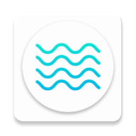

# Yosemite Summer Camp

> Estudo sobre imagens vetorizadas no Android

## Projeto 

Desenvolvido seguindo o artigo [Porque e Como Utilizar Vetores no Android](https://www.thiengo.com.br/porque-e-como-utilizar-vetores-no-android) produzido pelo [Vinícius Thiengo](https://github.com/viniciusthiengo)

## Sobre

Trata-se do projeto de exemplo utilizado para estudos da API de drawables vetoriais estáticos no Android.

## Extra

Para fim de estudos, foi implementado teste instrumentado de UI utilizando o Espresso

