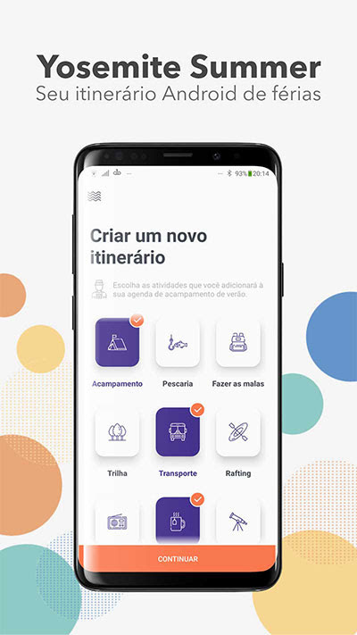

# Projeto desenvolvido seguindo o artigo [Porque e Como Utilizar Vetores no Android](https://www.thiengo.com.br/porque-e-como-utilizar-vetores-no-android) produzido pelo [Vinícius Thiengo](https://github.com/viniciusthiengo)

#Sobre
Trata-se do projeto de exemplo utilizado para estudos da API de drawables vetoriais estáticos no Android.

